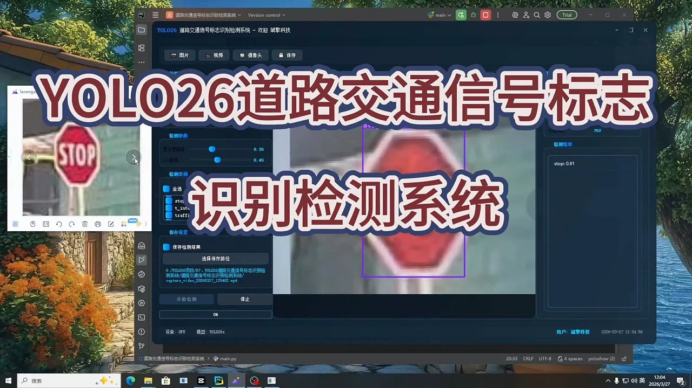
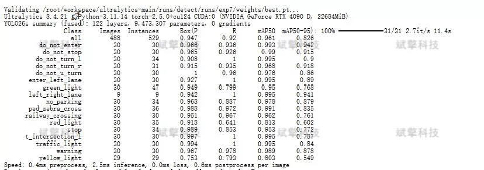
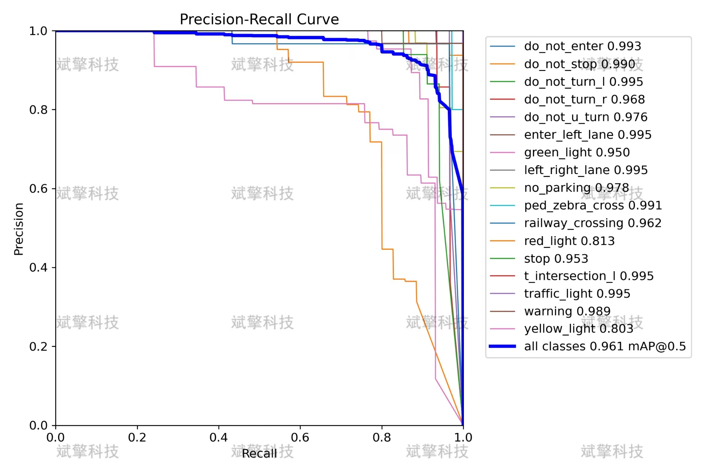
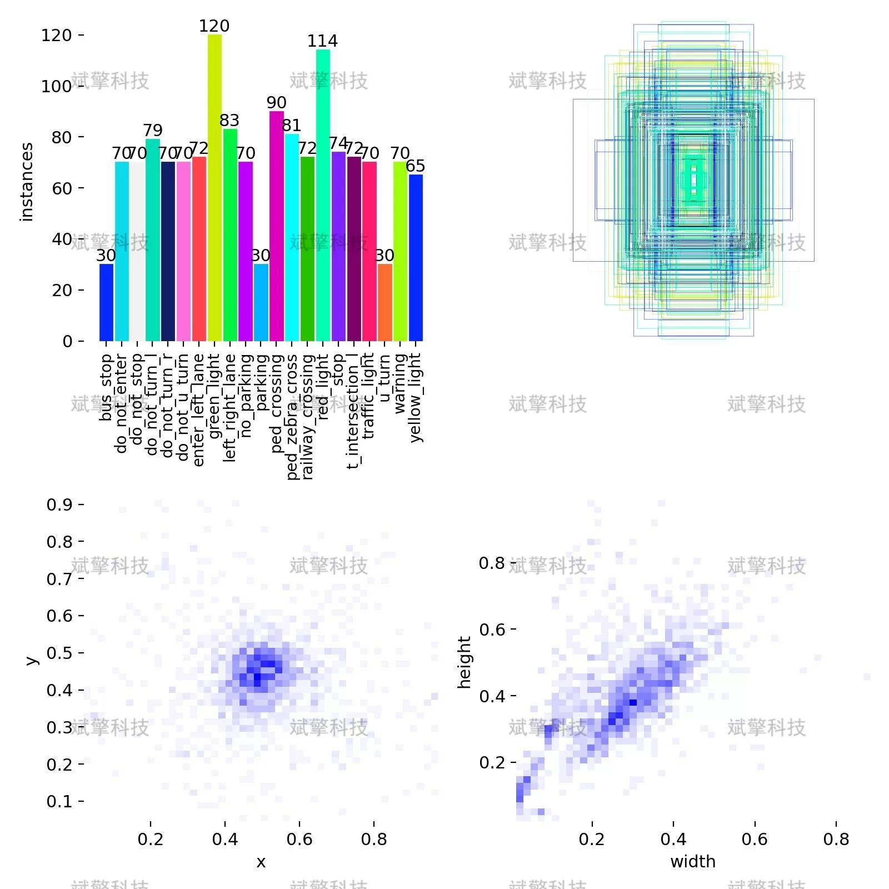
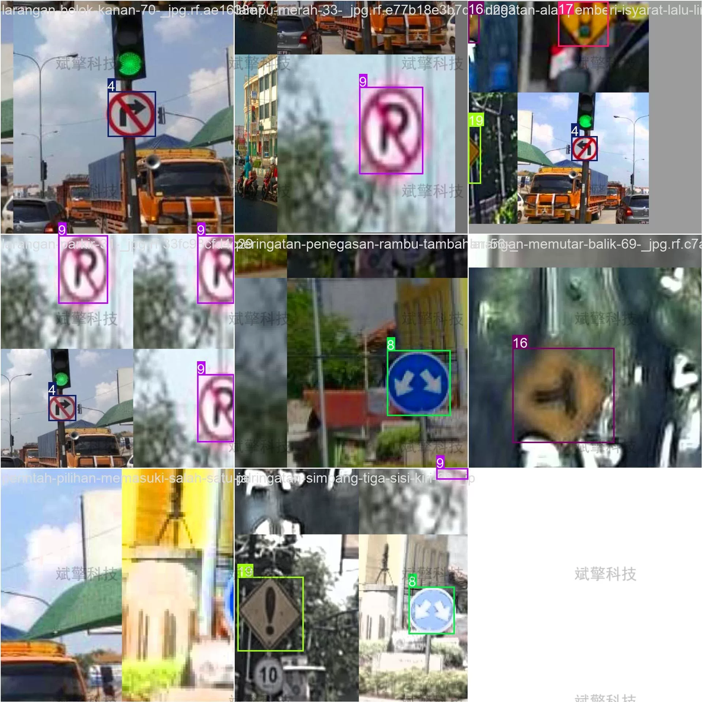
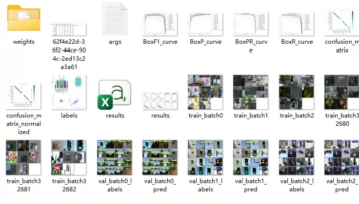
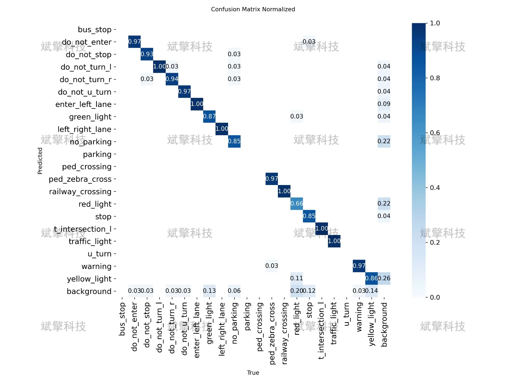
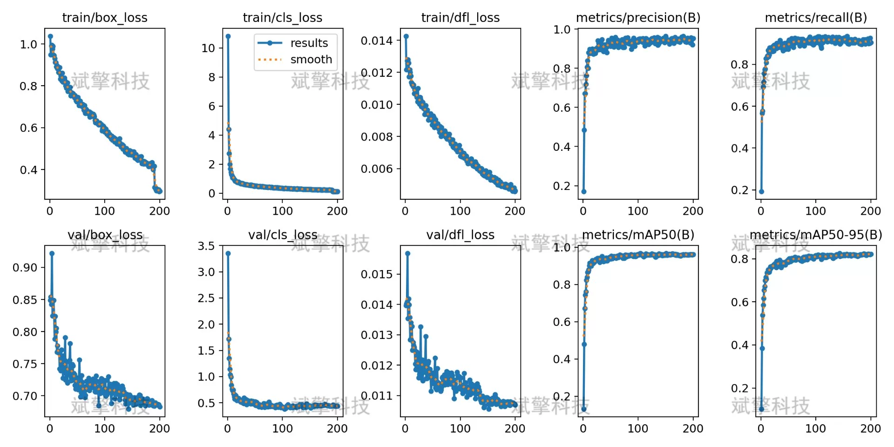
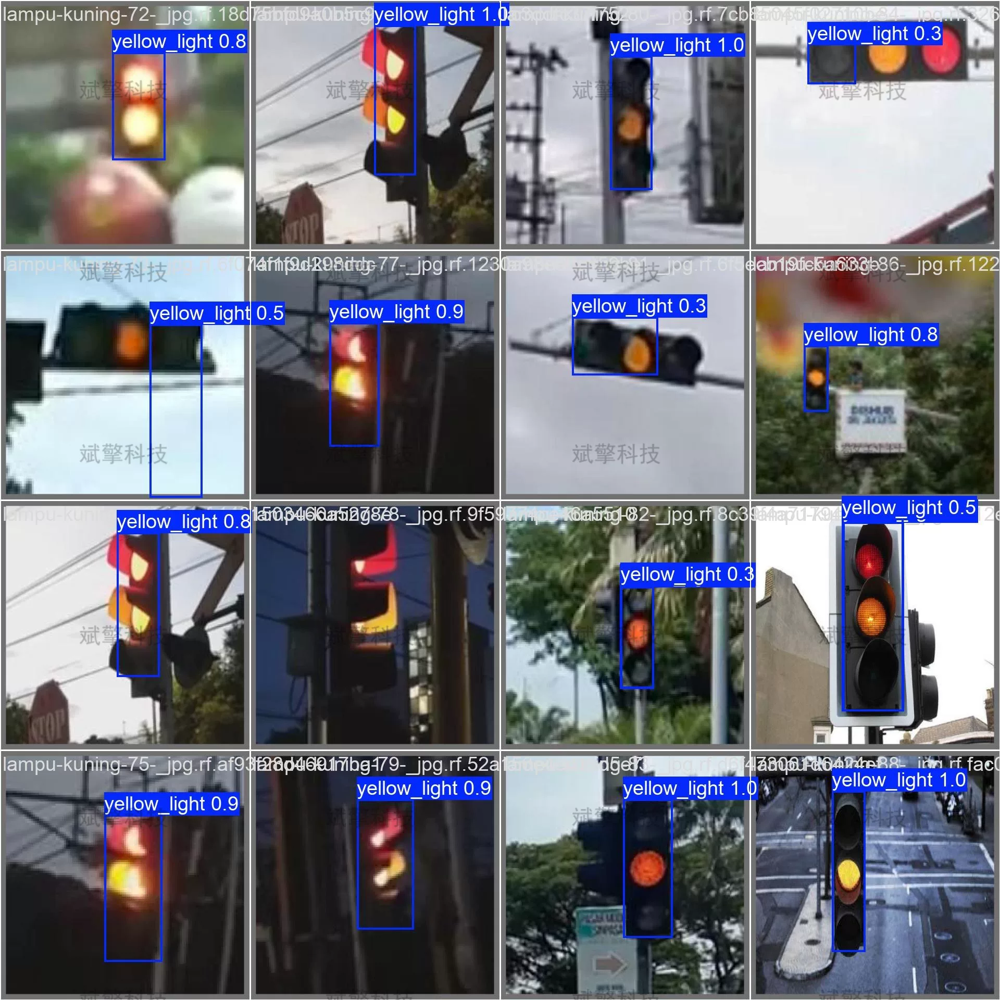

# YOLO26 Road Traffic Sign Recognition and Detection System

## Body

YOLO26 Road Sign Recognition Detection System for 21 Types of Road Signs: A High-Precision Recognition System Based on YOLO26

With the rapid development of intelligent transportation systems and autonomous driving technologies, accurate recognition of road traffic signal signs has become one of the key technologies to ensure vehicle safety. This paper constructs a recognition detection system for 21 types of road traffic signal signs based on the YOLO26 object detection algorithm. The system uses 1376 images as the training set, 488 as the validation set, and 229 as the test set, covering various categories such as prohibitive signs, directional signs, warning signs, traffic signals, etc. The experimental results show that the model achieved an mAP50 of 0.961 and an mAP50-95 of 0.826 on the validation set, with the detection accuracy of most categories exceeding 0.99, demonstrating excellent detection performance. For the few categories that performed poorly, this paper analyzes their reasons and proposes improvement suggestions. This system provides reliable technical support for intelligent driving environment perception.

Data Partitioning
To ensure the effectiveness of model training and the reliability of evaluation, the dataset is divided into the following proportions:
Training set: 1376 images
Validation set: 488 images
Test set: 229 images

Free reservation for remote installation. Unsuccessful full refund.
Purchase Enjoy the following resources (Baidu Drive automatically unlocks)
YOLO Recognition Detection Project Complete Source Code
YOLO format datasets
Training code + UI interface code
Trained model + result images
Software install package
Add WeChat to make a reservation for remote installation (Automatically display WeChat ID after purchase) - Unsuccessful, full refund

⚙️ Core Function Modules
Detection Capability
Image detection: Upon upload, return detection boxes + category information
Video detection: Support video files, analyze frames accurately in real-time
Camera real-time detection: Connect USB cameras to achieve dynamic monitoring
Interaction and Control
Target filtering: Choose one or more categories for detection
Parameter real-time adjustment: Adjustable confidence threshold & IoU threshold, flexibly control precision
Result saving: Save image/video/camera detection results in one click
System and Data
User login registration: Support password strength detection + encryption storage
Log recording: Automate operation and error information recording (with timestamp)

## Images

## Payment

Here is a pay link on Stripe ( https://buy.stripe.com/3cs8yP7sY87d0vu9AB ). Please contact me lonlonago@foxmail.com after funding $89, and I will send you a complete data files , thank you!

